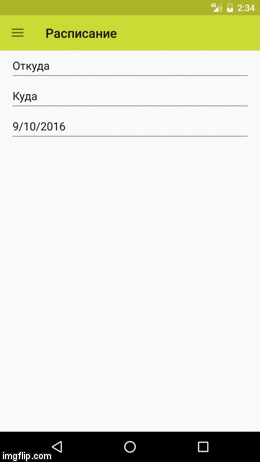

# Тестовое задание в компанию Tutu.ru

* Приложение состоит из двух экранов - "Расписание" и "О приложении".
* В разделе расписание можно выбрать станцию отправления, станцию прибытия и дату отправления.
* На странице выбора станции - станции сгруппированы по странам и городам, можно осуществлять поиск по части имени станции.
* Данные загружаются из папки *assets/allStations.json*.
* JUnit тесты
* Android Instramental тесты

## Screenshots

